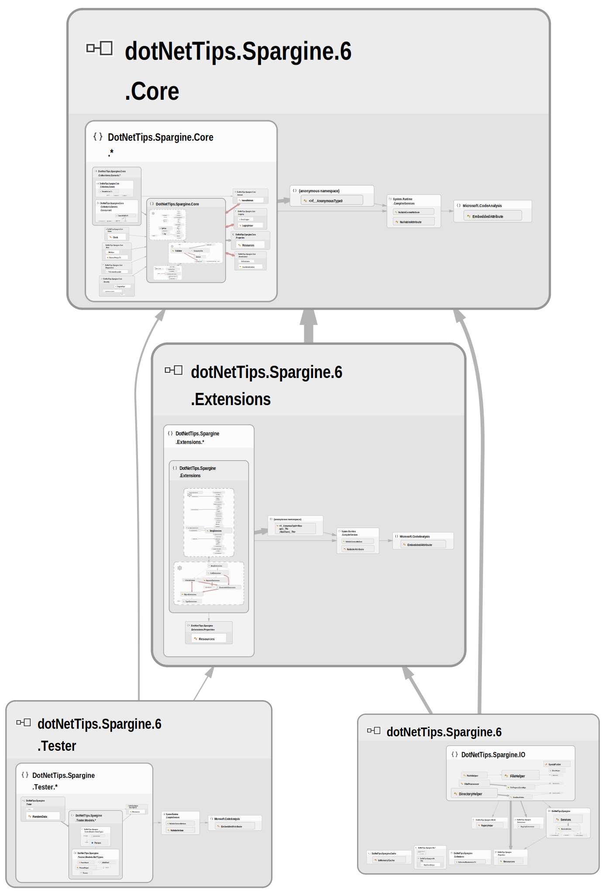

# dotNetTips.Spargine for .NET 6

Open-source .NET assemblies from dotNetTips.com and David (dotNetDave) McCarter
This repository is for the dotNetTips.Spargine code for .NET 6. Please support this project by <a href="https://github.com/sponsors/RealDotNetDave" target="_blank">**clicking here**</a>. 
<a href="https://dotnettips.wordpress.com/spargine/" target="_blank">Click here</a> to visit the Spargine page on dotNetTips.com. Much of this code is also documented on <a href="https://dotnettips.wordpress.com/category/open-source/spargine/" target="_blank">dotNetTips.com</a>.

> <a href="README-5.md" target="_blank">Click here</a> for the .NET 5 version of Spargine.

## GitHub
All of the assemblies listed below can be found on GitHub by <a href="https://www.nuget.org/packages?q=spargine+dotnettips" target="_blank">clicking here</a>. **Latest Official Release: v2022.6.5.31**

## Projects

*Generated by NDepend <a href="https://www.ndepend.com/" target="_blank">https://www.ndepend.com/</a>*
# Projects
Below is the list of current projects in this repository
### .NET 5
*  	**dotNetTips.Spargine:** Library that targets Windows
*   **dotNetTips.Spargine.Core:** Core library used by all of the other assemblies.
*   **dotNetTips.Spargine.Extensions:** Library for extension methods.
*   **dotNetTips.Spargine.Tester:** Library for creating dummy data for use in unit & benchmark tests.
### Benchmark Tests
Below are the current benchmark results for these projects. *Currently it takes 4.5 hours to run all the benchmark tests.*
#### dotNetTips.Spargine
1. <a href="https://github.com/RealDotNetDave/dotNetTips.Spargine/blob/main/docs/Benchmark%20Results/6/DotNetTips.Spargine.BenchmarkTests.IO.DirectoryHelperBenchmark-report-github.md" target="_blank">DirectoryHelper</a>
#### dotNetTips.Spargine.Core
1. CachedEnumerable
2. <a href="https://github.com/RealDotNetDave/dotNetTips.Spargine/blob/main/docs/Benchmark%20Results/6/DotNetTips.Spargine.Core.BenchmarkTests.Collections.Threading.ChannelQueueCollectionBenchmark-report-github.md" target="_blank">ChannelQueueCollection</a>
2. <a href="https://github.com/RealDotNetDave/dotNetTips.Spargine/blob/main/docs/Benchmark%20Results/6/DotNetTips.Spargine.Core.BenchmarkTests.Collections.CollectionCollectionBenchmark-report-github.md" target="_blank">Collection</a>
3. <a href="https://github.com/RealDotNetDave/dotNetTips.Spargine/blob/main/docs/Benchmark%20Results/6/DotNetTips.Spargine.Core.BenchmarkTests.Security.EncryptionHelperBenchmark-report-github.md" target="_blank">EncryptionHelper</a>
3. <a href="https://github.com/RealDotNetDave/dotNetTips.Spargine/blob/main/docs/Benchmark%20Results/6/DotNetTips.Spargine.Core.BenchmarkTests.Serialization.SerializationBenchmark-report-github.md" target="_blank">Serialization</a>
3. <a href="https://github.com/RealDotNetDave/dotNetTips.Spargine/blob/main/docs/Benchmark%20Results/6/DotNetTips.Spargine.Core.BenchmarkTests.StringBuilderHelperCounterBenchmark-report-github.md" target="_blank">StringBuilderHelper</a>
4. <a href="https://github.com/RealDotNetDave/dotNetTips.Spargine/blob/main/docs/Benchmark%20Results/6/DotNetTips.Spargine.Core.BenchmarkTests.TypeHelperBenchmark-report-github.md" target="_blank">TypeHelper</a>

#### dotNetTips.Spargine.Extensions
1. <a href="https://github.com/RealDotNetDave/dotNetTips.Spargine/blob/main/docs/Benchmark%20Results/6/DotNetTips.Spargine.Extensions.BenchmarkTests.ArrayExtensionsCollectionBenchmark-report-github.md" target="_blank">Array</a>
1. <a href="https://github.com/RealDotNetDave/dotNetTips.Spargine/blob/main/docs/Benchmark%20Results/6/DotNetTips.Spargine.Extensions.BenchmarkTests.Extensions.AssemblyExtensionsBenchmark-report-github.md" target="_blank">Assembly</a>
3. <a href="https://github.com/RealDotNetDave/dotNetTips.Spargine/blob/main/docs/Benchmark%20Results/6/DotNetTips.Spargine.Extensions.BenchmarkTests.CollectionExtensionsCollectionBenchmark-report-github.md" target="_blank">Collection</a>
4. <a href="https://github.com/RealDotNetDave/dotNetTips.Spargine/blob/main/docs/Benchmark%20Results/6/DotNetTips.Spargine.Extensions.BenchmarkTests.DictionaryExtensionsCollectionBenchmark-report-github.md" target="_blank">Dictionary</a>
5. <a href="https://github.com/RealDotNetDave/dotNetTips.Spargine/blob/main/docs/Benchmark%20Results/6/DotNetTips.Spargine.Extensions.BenchmarkTests.EnumExtensionsBenchmark-report-github.md" target="_blank">Enum</a>
6. <a href="https://github.com/RealDotNetDave/dotNetTips.Spargine/blob/main/docs/Benchmark%20Results/6/DotNetTips.Spargine.Extensions.BenchmarkTests.EnumerableExtensionsCollectionBenchmark-report-github.md" target="_blank">Enumerable</a>
7. <a href="https://github.com/RealDotNetDave/dotNetTips.Spargine/blob/main/docs/Benchmark%20Results/6/DotNetTips.Spargine.Extensions.BenchmarkTests.ExceptionExtensionsBenchmark-report-github.md" target="_blank">Exception</a>
8. <a href="https://github.com/RealDotNetDave/dotNetTips.Spargine/blob/main/docs/Benchmark%20Results/6/DotNetTips.Spargine.Extensions.BenchmarkTests.ListExtensionsCollectionBenchmark-report-github.md" target="_blank">List</a>
9. <a href="https://github.com/RealDotNetDave/dotNetTips.Spargine/blob/main/docs/Benchmark%20Results/6/DotNetTips.Spargine.Extensions.BenchmarkTests.ObjectExtensionsBenchmark-report-github.md" target="_blank">Object</a>
9. <a href="https://github.com/RealDotNetDave/dotNetTips.Spargine/blob/main/docs/Benchmark%20Results/6/DotNetTips.Spargine.Extensions.BenchmarkTests.ObservableCollectionExtensionsCollectionBenchmark-report-github.md" target="_blank">ObserableCollection</a>
10. <a href="https://github.com/RealDotNetDave/dotNetTips.Spargine/blob/main/docs/Benchmark%20Results/6/DotNetTips.Spargine.Extensions.BenchmarkTests.StringBuilderExtensionsCounterBenchmark-report-github.md" target="_blank">StringBuilder</a>
11. <a href="https://github.com/RealDotNetDave/dotNetTips.Spargine/blob/main/docs/Benchmark%20Results/6/DotNetTips.Spargine.Extensions.BenchmarkTests.StringExtensionsCounterBenchmark-report-github.md" target="_blank">String</a>
#### dotNetTips.Spargine.Tester
1. <a href="https://github.com/RealDotNetDave/dotNetTips.Spargine/blob/main/docs/Benchmark%20Results/6/DotNetTips.Spargine.Extensions.BenchmarkTests.Tester.RandomDataBenchmark-report-github.md" target="_blank">RandomData</a>
# Your Support Is Appreciated!
Do you have code you would like to submit to these repositories? Submit a pull request or submit an issue. I promise to take a look and include it if I like it! **I might just send you some cool geeky swag that includes one of my books (as supplies last).** You can also support this via GitHub Sponsors: <a href="https://github.com/sponsors/RealDotNetDave" target="_blank">https://github.com/sponsors/RealDotNetDave</a>
